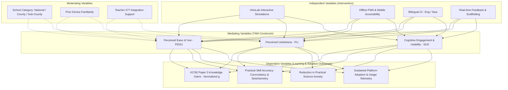
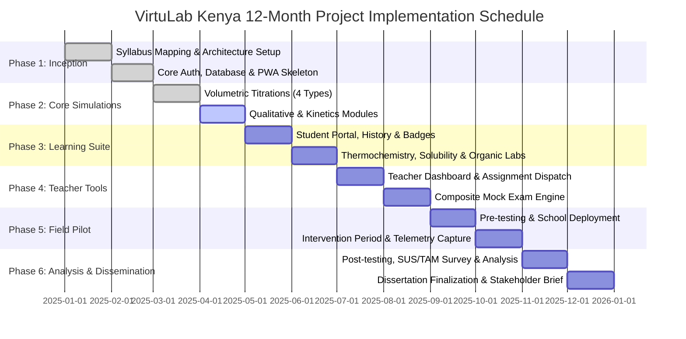

# PROJECT PROPOSAL

## VirtuLab Kenya: An Offline-First, Curriculum-Aligned Virtual Chemistry Laboratory Platform for Secondary Schools in Kenya

---

**Candidate / Principal Investigator:** [Candidate Name]  
**Programme:** Master of Science in Learning Design and Technology  
**Institution:** Open University of Kenya (OUK)  
**Academic Year:** 2025/2026  
**Target Syllabus:** Kenya Institute of Curriculum Development (KICD) Form 1–4 Chemistry & KCSE Paper 3 (233/3) Practical  
**Project Repository:** `virtulabkenya`  

---

## Executive Summary

Practical science education is fundamental to developing critical thinking, problem-solving, and scientific inquiry skills among secondary school learners. In Kenya, Chemistry is a core science subject examined both theoretically and practically through the Kenya Certificate of Secondary Education (KCSE) Chemistry Practical Examination (Paper 233/3). However, over 60% of secondary schools—particularly public sub-county and rural day schools—lack functional, adequately equipped science laboratories, consumable reagents, and trained laboratory technicians. Consequently, thousands of learners sit high-stakes national practical examinations having experienced science solely through chalk-and-talk demonstrations or theoretical rote memorization.

**VirtuLab Kenya** is an innovative, low-cost, offline-first digital learning platform designed to bridge this practical science divide. Built as a lightweight Progressive Web App (PWA) with Node.js/PostgreSQL backend services, VirtuLab Kenya provides realistic, mathematically grounded, and visually responsive virtual laboratory practicals directly mapped to the KICD syllabus and KCSE Paper 3 practical formats. The platform covers volumetric analysis (acid-base, redox, precipitation, complexometric titrations), qualitative inorganic analysis, reaction kinetics, chemical energetics, solubility curves, organic qualitative tests, and composite timed mock practicals. 

To ensure contextual relevance and equity, the platform features:
1. **Zero-Bandwidth Resilience:** Full offline execution via service workers and client-side simulation engines with background telemetry sync.
2. **Dual-Language Scaffolding:** Native bilingual support (English and Kiswahili) to support conceptual grasp.
3. **Teacher Diagnostic Ecosystem:** Real-time class dashboards providing granular diagnostic telemetry on student titration concordancy, calculation errors, and practical proficiency.
4. **Pedagogical Scaffolding:** Guided inquiry modes, automated volumetric error feedback, interactive Meniscus readings, and adaptive speed challenges.

This proposal details the problem statement, theoretical underpinning (Cognitive Theory of Multimedia Learning, Inquiry-Based Science Education, and Technology Acceptance Model), technical architecture, 12-month implementation plan, mixed-methods quasi-experimental evaluation methodology, budgetary requirements, and risk mitigation strategies for piloting across selected Kenyan secondary schools.

---

## 1. Introduction & Background

### 1.1 Context of Science Education in Kenya
Kenya's Vision 2030 and the National Education Sector Strategic Plan place science, technology, engineering, and mathematics (STEM) at the heart of national socio-economic transformation. The ongoing Competency-Based Curriculum (CBC) transition and the existing 8-4-4 secondary curriculum both emphasize experiential, hands-on scientific inquiry over passive memorization.

In secondary school Chemistry (Forms 1 through 4), laboratory work is not merely supplementary; it constitutes an entire standalone national examination paper: **KCSE Chemistry Paper 3 (Subject Code 233/3)**, which accounts for 40% of the overall Chemistry grade. Mastery of Paper 3 requires practical competency in:
- Precision volumetric manipulation (pipetting, burette handling, meniscus reading, indicator end-point detection).
- Concordant titre determination (recording values within $\pm 0.10 \text{ cm}^3$ or $\pm 0.20 \text{ cm}^3$).
- Stoichiometric calculations (mole ratios, molarities, percentage purity, water of crystallization).
- Systematic qualitative analysis (observing precipitates, solubility in excess reagents, flame tests, gas identification).
- Reaction kinetics, thermochemistry, and qualitative organic functional group testing.

### 1.2 The Laboratory Infrastructure Crisis
Despite the critical weight of practical assessments, a severe structural deficit exists across Kenya's educational landscape:
- **Infrastructure Disparity:** While top-tier National and Extra-County boarding schools possess multi-room laboratories with running gas, water, and specialized glassware, the vast majority of Sub-County Day Secondary Schools (which enroll over 65% of secondary students) have either empty laboratory halls, multi-purpose classrooms, or no laboratory infrastructure at all.
- **Cost and Perishability of Reagents:** Chemical reagents (such as silver nitrate, potassium manganate(VII), standard molar acids, and indicators) are costly and have short shelf-lives. Under-resourced schools often reserve chemicals strictly for the final examination rehearsal, denying learners routine experimental practice.
- **Safety and Class Size Bottlenecks:** Student-to-teacher ratios often exceed 50:1 in Kenyan public schools. Conducting wet chemistry experiments involving hazardous concentrated acids, toxic gases ($\text{SO}_2$, $\text{Cl}_2$, $\text{H}_2\text{S}$), or open Bunsen flames presents extreme safety hazards when supervision and ventilation are inadequate.

### 1.3 Digital Interventions in Low-Resource Contexts
Virtual science laboratories have emerged globally as effective digital scaffolds. However, existing commercial virtual labs (such as Labster or PhET) present significant contextual barriers in Sub-Saharan Africa:
- High recurring per-student subscription fees.
- Heavy 3D WebGL graphics engines that crash on entry-level Android smartphones and Chromebooks.
- Heavy reliance on constant, high-speed 4G/fiber internet connectivity.
- Misalignment with national examination marking schemes (e.g., KCSE specific table formats, penalty schemes for non-concordant titres, and specific ionic precipitation tables).

**VirtuLab Kenya** is built from the ground up to solve these contextual constraints.

---

## 2. Statement of the Problem & Objectives

### 2.1 Problem Statement
Secondary school students in resource-constrained Kenyan secondary schools suffer persistent underperformance and high attrition in KCSE Chemistry due to the lack of hands-on laboratory access. This lack of practical experience results in high failure rates on KCSE Paper 3, severe practical anxiety, inaccurate manipulation of quantitative data, and depressed national STEM enrollment. There is an urgent, unmet need for a curriculum-aligned, zero-marginal-cost, low-bandwidth, offline-capable virtual chemistry laboratory tailored to the Kenyan syllabus that empowers both independent student practice and teacher-led diagnostic assessment.

### 2.2 Research Questions
1. **RQ1 (Learning Effectiveness):** To what extent does the integration of VirtuLab Kenya improve secondary school students' conceptual understanding and practical problem-solving scores in KCSE Chemistry Paper 3 topics compared to traditional non-laboratory/lecture-based instruction?
2. **RQ2 (Usability & Accessibility):** How usable, accessible, and responsive is the offline-first Progressive Web App interface when deployed on entry-level mobile devices and low-connectivity school environments in Kenya, as measured by the System Usability Scale (SUS)?
3. **RQ3 (Pedagogical Acceptance):** What are Kenyan chemistry teachers' and students' perceptions regarding the perceived usefulness (PU), perceived ease of use (PEOU), and behavioral intention (BI) to adopt VirtuLab Kenya, framed under the Technology Acceptance Model (TAM)?
4. **RQ4 (Diagnostic Utility):** How effectively do automated telemetry error logs (e.g., indicator selection errors, non-concordant titre rates, calculation deviation) enable teachers to identify and remediate specific student misconceptions in real time?

### 2.3 Research Hypotheses
- **$H_0$ (Null):** There is no statistically significant difference in KCSE Paper 3 post-test scores between learners utilizing VirtuLab Kenya and learners taught through traditional classroom instruction without physical lab access ($p > 0.05$).
- **$H_1$ (Alternative):** Learners utilizing VirtuLab Kenya will demonstrate a statistically significant gain in post-test scores and practical competency metrics compared to the control group ($p < 0.05$, normalized learning gain $g \ge 0.40$).

### 2.4 Research Objectives

#### General Objective
To design, develop, deploy, and evaluate an offline-first, KICD-aligned virtual chemistry laboratory platform (VirtuLab Kenya) to democratize practical science learning for secondary school learners in Kenya.

#### Specific Objectives
1. **Design & Development:** Build a lightweight, responsive Progressive Web App featuring seven core virtual laboratory modules covering all major KCSE Paper 3 practical domains with bilingual (English/Kiswahili) support.
2. **Pedagogical Integration:** Implement intelligent scaffolding mechanisms, including interactive meniscus magnification, indicator color transition kinetics, concordance algorithms ($\pm 0.10 \text{ cm}^3$), and automated step-by-step stoichiometric evaluation.
3. **Teacher Diagnostic Tools:** Develop an administrative and teacher analytics dashboard providing real-time class monitoring, custom assignment broadcasting, and error-pattern classification.
4. **Empirical Evaluation:** Conduct a quasi-experimental pilot study across selected Kenyan secondary schools (stratified by school category) to measure learning gains, usability (SUS), and technological acceptance (TAM).
5. **Policy & Dissemination:** Formulate policy recommendations and an open deployment framework for institutional adoption by KICD, the Ministry of Education, and partner teacher training colleges.

---

## 3. Significance and Justification

```
                                  ┌───────────────────────────────┐
                                  │      EQUITY & INCLUSIVITY     │
                                  │  Democratizing STEM access    │
                                  │  for Sub-County & Rural Day   │
                                  └───────────────┬───────────────┘
                                                  │
            ┌─────────────────────────────────────┼─────────────────────────────────────┐
            │                                     │                                     │
            ▼                                     ▼                                     ▼
┌───────────────────────┐             ┌───────────────────────┐             ┌───────────────────────┐
│     FOR LEARNERS      │             │     FOR EDUCATORS     │             │    FOR INSTITUTIONS   │
│ • Safe trial & error  │             │ • Continuous formative│             │ • Zero chemical waste │
│ • Instant feedback    │             │   assessment analytics│             │ • Low-cost scalability│
│ • Mastery pacing      │             │ • Targeted remediation│             │ • KICD CBC alignment  │
│ • Bilingual support   │             │ • Zero setup overhead │             │ • Resilient to outages│
└───────────────────────┘             └───────────────────────┘             └───────────────────────┘
```

- **For Learners:** Provides an infinite, risk-free sandbox where learners can repeat experiments without fear of chemical burns, glassware breakage, or reagent rationing. Eliminates practical exam anxiety.
- **For Educators:** Transforms homework and pre-lab preparation. Teachers no longer spend limited class time on basic procedural instructions and can utilize the dashboard's diagnostic logs to detect class-wide misconceptions before high-stakes exams.
- **For Educational Policy & Environment:** Delivers zero chemical waste, zero hazardous vapor emissions, and substantial cost savings for secondary schools operating on constrained capitation funds.

---

## 4. Theoretical and Conceptual Framework

### 4.1 Theoretical Foundations

1. **Constructivism & Inquiry-Based Science Education (IBSE):**  
   Rooted in Piaget (1973) and Bybee’s 5E Instructional Model (*Engage, Explore, Explain, Elaborate, Evaluate*). VirtuLab Kenya allows learners to manipulate variables (e.g., burette flow rate, concentration, indicator choice, temperature), observe authentic physical responses (color transitions, gas evolution, precipitates), and construct conceptual schemas from empirical data.

2. **Cognitive Theory of Multimedia Learning (CTML) & Cognitive Load Theory (CLT):**  
   Mayer’s (2009) principles and Sweller’s (1988) cognitive load theory dictate the UI/UX design:
   - *Spatial Contiguity Principle:* Apparatus, readouts, and guidance notes are co-located to minimize split-attention effect.
   - *Signaling Principle:* Key data points (meniscus alignment, end-point flashing) are subtly highlighted to guide working memory.
   - *Scaffolding Modality:* Dual-mode design allows novice learners to start in *Guided Mode* (with prompts and step validation) and transition to *Exam Mode* (unscaffolded, timed, authentic exam conditions).

3. **Technology Acceptance Model (TAM 3):**  
   Proposed by Davis (1989) and extended by Venkatesh & Bala (2008), measuring how Perceived Usefulness (PU) and Perceived Ease of Use (PEOU) influence Teachers' and Students' Behavioral Intention (BI) and actual usage metrics.

### 4.2 Conceptual Framework Diagram



---

## 5. System Architecture & Technical Specifications

### 5.1 System Overview
VirtuLab Kenya is engineered around a modern, modular, low-overhead client-server architecture optimized for low-bandwidth, intermittent-connectivity environments.

```
┌─────────────────────────────────────────────────────────────────────────────────┐
│                              CLIENT TIER (PWA)                                  │
│  ┌─────────────────────────┐ ┌─────────────────────────┐ ┌───────────────────┐ │
│  │    Student Dashboard    │ │    Virtual Chemistry    │ │ Teacher Analytics │ │
│  │   & Revision History    │ │    Simulation Engine    │ │    & Dashboard    │ │
│  └────────────┬────────────┘ └────────────┬────────────┘ └─────────┬─────────┘ │
│               │                           │                        │           │
│  ┌────────────┴───────────────────────────┴────────────────────────┴─────────┐ │
│  │               Service Worker & Cache Storage (Offline Engine)             │ │
│  │               LocalStorage / IndexedDB (Local Session Cache)              │ │
│  └────────────────────────────────────────┬──────────────────────────────────┘ │
└───────────────────────────────────────────┼─────────────────────────────────────┘
                                            │ HTTPS / REST API (JWT Authenticated)
                                            │ [Auto-Sync when online]
┌───────────────────────────────────────────▼─────────────────────────────────────┐
│                              SERVER TIER (Node.js)                              │
│  ┌───────────────────────────────────────────────────────────────────────────┐  │
│  │ Express REST API Gateway (/api/auth, /api/sessions, /api/assignments, etc) │  │
│  ├───────────────────────────────────────────────────────────────────────────┤  │
│  │ Middleware: JWT Auth Verification, Role-Based Access Control, Rate Limiter│  │
│  ├───────────────────────────────────────────────────────────────────────────┤  │
│  │ Business Logic: Telemetry Analyzer, Leaderboard, Badge Evaluator, Grading │  │
│  └────────────────────────────────────────┬──────────────────────────────────┘  │
└───────────────────────────────────────────┼─────────────────────────────────────┘
                                            │ Connection Pool
┌───────────────────────────────────────────▼─────────────────────────────────────┐
│                           DATABASE TIER (PostgreSQL)                            │
│  ┌──────────────┐ ┌───────────────┐ ┌───────────────┐ ┌──────────────────────┐  │
│  │ users table  │ │ schools table │ │classes / tea. │ │ lab_sessions table   │  │
│  ├──────────────┤ ├───────────────┤ ├───────────────┤ ├──────────────────────┤  │
│  │ assignments  │ │ badges table  │ │ student_badges│ │ error_telemetry      │  │
│  └──────────────┘ └───────────────┘ └───────────────┘ └──────────────────────┘  │
└─────────────────────────────────────────────────────────────────────────────────┘
```

### 5.2 Laboratory Modules Implemented & Roadmap

| Module | Simulated Experiment | Target KCSE Practical Skills | Syllabus Code |
|---|---|---|---|
| **1. Volumetric Analysis** | • Acid-Base Titrations ($\text{HCl}/\text{NaOH}$, $\text{H}_2\text{SO}_4/\text{Na}_2\text{CO}_3$)<br>• Redox Titrations ($\text{KMnO}_4/\text{Fe}^{2+}$, $\text{I}_2/\text{S}_2\text{O}_3^{2-}$)<br>• Precipitation Titration (Mohr's Method)<br>• Complexometric Titration ($\text{EDTA}/\text{Ca}^{2+}$, $\text{Mg}^{2+}$) | • Pipette priming & meniscus zeroing<br>• Dropwise burette tap flow regulation<br>• Indicator end-point color transitions<br>• Concordant titre selection ($\Delta V \le 0.10 \text{ cm}^3$)<br>• Multi-step stoichiometric calculation | Form 3 / Form 4<br>Paper 3 Q1 |
| **2. Qualitative Inorganic Analysis** | • Systematic Cation tests ($\text{Fe}^{2+}, \text{Fe}^{3+}, \text{Cu}^{2+}, \text{Al}^{3+}, \text{Pb}^{2+}, \text{Zn}^{2+}, \text{Ca}^{2+}, \text{NH}_4^+$)<br>• Anion identification ($\text{SO}_4^{2-}, \text{SO}_3^{2-}, \text{CO}_3^{2-}, \text{Cl}^-, \text{NO}_3^-$)<br>• Flame tests & gas confirmation ($\text{CO}_2, \text{SO}_2, \text{NH}_3, \text{O}_2, \text{Cl}_2$) | • Dropwise addition of $\text{NaOH}_{(aq)}$ & $\text{NH}_{3(aq)}$ to excess<br>• Precipitate dissolution observation<br>• Systematic inference deduction logic | Form 4<br>Paper 3 Q2 |
| **3. Chemical Kinetics (Rates of Reaction)** | • Sodium thiosulphate + Hydrochloric acid (Disappearing cross method)<br>• Magnesium ribbon + Acid (Gas syringe volume measurement) | • Reaction rate curve plotting ($1/t \text{ vs Conc/Temp}$)<br>• Gradient calculation<br>• Collision theory interpretation | Form 4<br>Paper 3 Q3 |
| **4. Chemical Energetics (Thermochemistry)** | • Enthalpy of neutralization ($\text{HCl} + \text{NaOH}$)<br>• Enthalpy of solution & displacement ($\text{CuSO}_4 + \text{Zn}$) | • Temperature-time extrapolation graphs<br>• Specific heat capacity ($\Delta H = mc\Delta T$)<br>• Molar heat calculation | Form 4<br>Paper 3 Q3 |
| **5. Solubility & Solubility Curves** | • Potassium chlorate ($\text{KClO}_3$) crystallization temperature measurement across dilution stages | • Cooling curve determination<br>• Solubility curve generation ($g/100g \text{ H}_2\text{O} \text{ vs } T^\circ\text{C}$) | Form 3<br>Topic 4 |
| **6. Qualitative Organic Chemistry** | • Saturated vs. Unsaturated hydrocarbons (Bromine water, $\text{KMnO}_4/\text{H}^+$)<br>• Carboxylic acids ($\text{Na}_2\text{CO}_3$ effervescence)<br>• Alkanols (Esterification, sodium metal test) | • Organic observation table recording<br>• Functional group inference deduction | Form 4<br>Organic Chem II |
| **7. Composite Mock Examination** | • Full 3-question timed composite practical replicating actual KCSE Paper 3 examination setting | • Exam pacing, data transcription, comprehensive mark-scheme grading | All Forms |

### 5.3 Technical Specifications Matrix

- **Frontend Core:** Pure Semantic HTML5, Responsive Vanilla CSS3 Design Tokens, Vanilla ECMAScript 2022. Fast execution without framework overhead (zero React/Vue bundle penalty), ensuring < 250ms initial load time on 3G networks.
- **Offline & Storage:** Progressive Web App (PWA) with Service Worker `Cache-First` / `Stale-While-Revalidate` strategies. Complete local simulation execution; background sync queue for telemetry.
- **Backend API:** Node.js v18+ with Express framework, helmet security headers, CORS protection, express-rate-limit.
- **Database:** PostgreSQL with relational integrity, foreign keys, b-tree indexes on session queries, and migration versioning.
- **Authentication & Authorization:** Stateless JSON Web Tokens (JWT) signed with HMAC-SHA256, bcrypt password hashing (work factor 10), and strict role-based access control (`student`, `teacher`, `admin`).
- **Telemetry & Diagnostic Logging:** Automated logging of step timestamps, trial counts, titre discrepancy, calculation errors, and hint utilization.

---

## 6. Research Methodology & Evaluation Design

```
                               ┌───────────────────────────────────────────────────────────┐
                               │   MIXED-METHODS CONVERGENT QUASI-EXPERIMENTAL DESIGN     │
                               └─────────────────────────────┬─────────────────────────────┘
                                                             │
                    ┌────────────────────────────────────────┴────────────────────────────────────────┐
                    │                                                                                 │
                    ▼                                                                                 ▼
     ┌───────────────────────────────┐                                                 ┌───────────────────────────────┐
     │      QUANTITATIVE STRAND      │                                                 │      QUALITATIVE STRAND       │
     │ • Pre-Test / Post-Test        │                                                 │ • Focus Group Discussions     │
     │ • System Usability Scale (SUS)│                                                 │ • Teacher In-Depth Interviews │
     │ • TAM 5-point Likert Surveys  │                                                 │ • Classroom Observations      │
     │ • Server Database Telemetry   │                                                 │ • Thematic Content Analysis   │
     └──────────────┬────────────────┘                                                 └───────────────┬───────────────┘
                    │                                                                                 │
                    └────────────────────────────────────────┬────────────────────────────────────────┘
                                                             │
                                                             ▼
                               ┌───────────────────────────────────────────────────────────┐
                               │      INTEGRATED SYNTHESIS & STATISTICAL TRIANGULATION     │
                               │ • Normalized Gain (g) & ANCOVA                            │
                               │ • Structural Equation Modeling / Regression for TAM       │
                               │ • Triangulated Pedagogical Efficacy Report                │
                               └───────────────────────────────────────────────────────────┘
```

### 6.1 Research Design
The study adopts a **Convergent Parallel Mixed-Methods Quasi-Experimental Design** featuring a **Pre-test / Post-test Non-Equivalent Control Group** structure.

- **Experimental Group ($E$):** Receives hybrid instruction utilizing VirtuLab Kenya for pre-lab preparation, interactive simulation practice, and homework assignments.
- **Control Group ($C$):** Receives traditional classroom instruction using standard textbooks and teacher chalk-and-talk demonstrations without access to interactive virtual simulation tools.

### 6.2 Target Population & Sampling Strategy
The sampling frame comprises Form 3 and Form 4 Chemistry students and their respective subject teachers in Kenya.

**Sampling Technique:** Stratified Purposive and Multi-Stage Cluster Sampling across three educational tiers:
1. **Stratum 1:** National / Extra-County Schools (High physical lab infrastructure baseline - 2 schools, $n \approx 120$ students).
2. **Stratum 2:** County Secondary Schools (Moderate lab infrastructure baseline - 3 schools, $n \approx 180$ students).
3. **Stratum 3:** Sub-County Day Secondary Schools (Low/zero lab infrastructure baseline - 5 schools, $n \approx 300$ students).
- **Total Sample Size:** $\approx 600$ secondary students and $\approx 20$ Chemistry educators.

### 6.3 Data Collection Instruments

1. **Chemistry Practical Competency Achievement Test (CPCAT):**
   - 40-mark standardized pre-test and post-test aligned with KCSE Paper 3 marking standards (validated by experienced KCSE national examiners).
   - Measures procedural knowledge, titration accuracy calculation, qualitative inference logic, and kinetic curve interpretation.

2. **System Usability Scale (SUS) Instrument:**
   - Standard 10-item international usability instrument (Brooke, 1996) administered to learners to calculate benchmark usability scores ($0 - 100$). Target threshold: $\text{SUS} \ge 78$ (Grade A/Excellent).

3. **Technology Acceptance Model (TAM) Questionnaire:**
   - 5-point Likert scale instrument assessing:
     - Perceived Usefulness (PU) (6 items)
     - Perceived Ease of Use (PEOU) (6 items)
     - Facilitating Conditions (FC) (4 items)
     - Behavioral Intention to Use (BI) (4 items)

4. **Automated Server-Side Telemetry Logs:**
   - High-precision telemetry metrics collected by the PostgreSQL database:
     - Mean titration trials per student.
     - Percentage of concordant titres achieved ($\le 0.10 \text{ cm}^3$ variance).
     - Indicator error rate (e.g., attempting methyl orange for weak acid/strong base).
     - Time-on-task per module and completion rates.

5. **Qualitative Semi-Structured Teacher & Student Interviews:**
   - Evaluates perceived pedagogical workload reduction, classroom dynamics, and contextual adoption bottlenecks.

### 6.4 Statistical Data Analysis Plan

1. **Learning Gain Measurement:**  
   Calculation of Hake's Average Normalized Learning Gain ($g$):
   $$g = \frac{\% \text{Posttest} - \% \text{Pretest}}{100\% - \% \text{Pretest}}$$
   *Interpretation:* High gain ($g \ge 0.70$), Medium gain ($0.30 \le g < 0.70$), Low gain ($g < 0.30$).

2. **Inferential Hypotheses Testing:**
   - **Paired Sample $t$-tests:** To evaluate within-group pre/post score improvements.
   - **Analysis of Covariance (ANCOVA):** To compare post-test scores between Experimental and Control groups while controlling for pre-test baseline scores as a covariate.
   - **Effect Size:** Calculation of Cohen's $d$ to establish educational significance:
     $$d = \frac{\bar{x}_1 - \bar{x}_2}{s_{\text{pooled}}}$$

3. **Reliability and Validity:**
   - Construct and content validity confirmed through expert review by KICD chemistry panel specialists.
   - Internal consistency calculated using Cronbach's alpha ($\alpha \ge 0.80$ required across all test scales).

---

## 7. Implementation Work Plan & Milestones

The project spans a **12-month development and evaluation lifecycle** structured across six core phases:



### Milestone & Deliverable Schedule

| Phase | Milestone / Key Deliverables | Timeline | Verification Criterion |
|---|---|---|---|
| **Phase 1** | • Requirements Specification & KICD alignment matrix<br>• Node.js/PostgreSQL backend & PWA service worker scaffolding | Months 1–2 | Working auth API, database schema migration scripts passed. |
| **Phase 2** | • Volumetric titration engine (Acid-Base, Redox, Precipitation, Complexometric)<br>• Mathematical chemical equilibria & kinetics engine | Months 3–4 | Precision burette simulation with concordancy checks verified. |
| **Phase 3** | • Qualitative inorganic analysis, energetics, solubility & organic tests<br>• Student dashboard, gamification badges & PDF certificates | Months 5–6 | 7 complete simulation modules functioning fully offline. |
| **Phase 4** | • Teacher dashboard with telemetry analytics & assignment broadcasting<br>• Timed composite mock practical exam module | Months 7–8 | Multi-school teacher/student role access successfully tested. |
| **Phase 5** | • NACOSTI research ethics clearance obtained<br>• 10 pilot schools onboarded, pre-tests administered, 8-week intervention | Months 9–10 | Active student usage logs recorded across $\ge 600$ learners. |
| **Phase 6** | • Post-tests, TAM & SUS questionnaires administered<br>• Statistical analysis (ANCOVA, Cohen's $d$, TAM regression)<br>• Master's dissertation submission & KICD policy brief | Months 11–12 | Final dissertation defended; open-source codebase published. |

---

## 8. Budget & Resource Requirements

The project budget reflects lean, sustainable resource allocation for pilot development, cloud hosting, field testing across sub-county schools, and research dissemination.

| Item Category | Description / Specific Items | Qty / Duration | Unit Cost (KES) | Total Cost (KES) | Total (USD equiv.) |
|---|---|---|---|---|---|
| **1. Cloud Infrastructure & Hosting** | • Railway / DigitalOcean Managed Server & PostgreSQL DB<br>• Domain Name (`virtulab.co.ke`) & SSL certificates | 12 Months | 4,500 / mo | 54,000 | ~$415 |
| **2. Pilot Hardware Support** | • Refurbished Android test tablets for sub-county day schools without computer labs | 10 Tablets | 12,000 | 120,000 | ~$920 |
| **3. Field Research & Travel** | • Field travel to rural & sub-county pilot schools (Nairobi, Machakos, Kiambu counties)<br>• Teacher orientation & training workshops | 10 Schools | 6,000 / school | 60,000 | ~$460 |
| **4. Printing & Materials** | • Standardized pre/post test booklets, consent forms, student certificates | 600 sets | 50 / set | 30,000 | ~$230 |
| **5. Research Licensing & Ethics** | • NACOSTI Research Permit & Institutional Review Board (IRB) Clearance | 1 Permit | 10,000 | 10,000 | ~$80 |
| **6. Dissemination & Publishing** | • Open-access journal publication fee & stakeholder presentation symposium | Lump Sum | 25,000 | 25,000 | ~$195 |
| **7. Contingency Reserve** | • 10% operational contingency for equipment repairs/data bundles | Lump Sum | 29,900 | 29,900 | ~$230 |
| **TOTAL** | | | | **KES 328,900** | **~$2,530** |

---

## 9. Risk Assessment & Mitigation Strategies

| Identified Risk | Severity | Likelihood | Mitigation Strategy |
|---|---|---|---|
| **Intermittent / Zero Internet in Rural Schools** | High | High | • Built as an offline-first PWA with Service Worker pre-caching.<br>• LocalStorage caching allows full offline lab simulations.<br>• Telemetry queued and auto-synced upon reconnecting. |
| **Limited Computer / Smartphone Access** | High | Medium | • Extreme responsive optimization for budget Android smartphones.<br>• Touch-friendly controls for shared single-device classroom rotation.<br>• Provision of 10 pilot tablets for under-resourced schools. |
| **Teacher Resistance or Low ICT Literacy** | Medium | Medium | • Zero-installation requirement (opens in standard mobile browser).<br>• Intuitive 2-click assignment dispatch.<br>• Teacher training workshops and quick-start Swahili/English video guides. |
| **Curriculum or Examination Format Drift** | Low | Low | • Direct collaboration with certified KCSE chemistry examiners.<br>• Modular simulation architecture allowing rapid parameter updates. |
| **Student Data Privacy & Protection** | Medium | Low | • Strict compliance with the Kenya Data Protection Act (2019).<br>• Password encryption via bcrypt, JWT authorization tokens, and anonymized research reporting. |

---

## 10. Ethical Considerations & Data Governance

1. **Institutional Ethical Approval:** A research permit will be obtained from the **National Commission for Science, Technology and Innovation (NACOSTI)** alongside institutional clearance from the **Open University of Kenya (OUK)** Directorate of Research.
2. **Informed Consent & Assent:** Parental/guardian consent and institutional headteacher permissions will be secured for all participating minor students (under 18). Student participation will be entirely voluntary, with freedom to withdraw at any stage without academic penalty.
3. **Data Protection & Anonymity:** In adherence to the **Kenya Data Protection Act (2019)**:
   - All student assessment data and telemetry logs will be anonymized using random alphanumeric student identifiers (`STU-XXXX`).
   - Passwords will be cryptographically hashed using industry-standard bcrypt.
   - Raw database records will be stored in secure, encrypted cloud databases accessible solely by the principal investigator.

---

## 11. Expected Outcomes, Impact & Sustainability

### 11.1 Academic & Practical Deliverables
1. **Fully Operational, Open-Access Platform:** A production-ready, open-source virtual chemistry laboratory PWA hosted and accessible at zero cost to Kenyan learners and educators.
2. **Empirical Master's Dissertation:** A rigorous Master's research thesis documenting the pedagogical efficacy, normalized learning gains, and adoption factors of virtual science labs in Sub-Saharan Africa.
3. **Policy Brief for KICD & MoE:** An actionable educational policy white paper presented to the Kenya Institute of Curriculum Development and Ministry of Education outlining strategic frameworks for scaling virtual STEM laboratories under the CBC Senior Secondary Pathways.
4. **Peer-Reviewed Scholarly Publication:** Submission of empirical findings to high-impact educational technology journals (e.g., *Computers & Education*, *Journal of Science Education and Technology*, or *African Journal of Educational and Information Opportunities*).

### 11.2 Long-Term Sustainability & Expansion
VirtuLab Kenya is architected for extensible multi-disciplinary scale:
- **Phase 7 Expansion:** Addition of **Physics Practicals** (Electrical Circuits, Ray Optics, Hooke’s Law, Mechanics) and **Biology Practicals** (Enzyme Kinetics, Osmosis, Food Tests, Respiration).
- **Institutional Integration:** Partnership with County Education Directorates and national teacher networks (e.g., CEMASTEA - Centre for Mathematics, Science and Technology Education in Africa) to embed VirtuLab Kenya into national in-service teacher professional development programs.

---

## 12. Key Academic References

- Brooke, J. (1996). SUS-A quick and dirty usability scale. *Usability Evaluation in Industry*, 189(194), 4-7.
- Bybee, R. W. (2009). *The BSCS 5E instructional model and 21st century skills*. National Academies Board on Science Education, Washington, DC.
- Davis, F. D. (1989). Perceived usefulness, perceived ease of use, and user acceptance of information technology. *MIS Quarterly*, 319-340.
- Hake, R. R. (1998). Interactive-engagement versus traditional methods: A six-thousand-student survey of mechanics test data for introductory physics courses. *American Journal of Physics*, 66(1), 64-74.
- Kenya Institute of Curriculum Development [KICD]. (2019). *Secondary Education Curriculum Designs: Chemistry Form 1–4*. KICD, Nairobi.
- Kenya National Examinations Council [KNEC]. (2022). *KCSE Examination Essential Performance Reports: Chemistry Paper 3 (233/3)*. KNEC, Nairobi.
- Mayer, R. E. (2009). *Multimedia Learning* (2nd ed.). Cambridge University Press.
- Ministry of Education Kenya. (2018). *National Education Sector Strategic Plan (NESSP) 2018–2022*. Government of Kenya.
- Sweller, J. (1988). Cognitive load during problem solving: Effects on learning. *Cognitive Science*, 12(2), 257-285.
- UNESCO. (2021). *STEM Education in Sub-Saharan Africa: Promoting equitable access to digital laboratory environments*. UNESCO Publishing, Paris.
- Venkatesh, V., & Bala, H. (2008). Technology acceptance model 3 and a research agenda on interventions. *Decision Sciences*, 39(2), 273-315.
- Wieman, C. E., Adams, W. K., & Perkins, K. K. (2008). PhET: Simulations that enhance learning. *Science*, 322(5902), 682-683.

---

*VirtuLab Kenya · Open University of Kenya · Master of Science in Learning Design and Technology*
